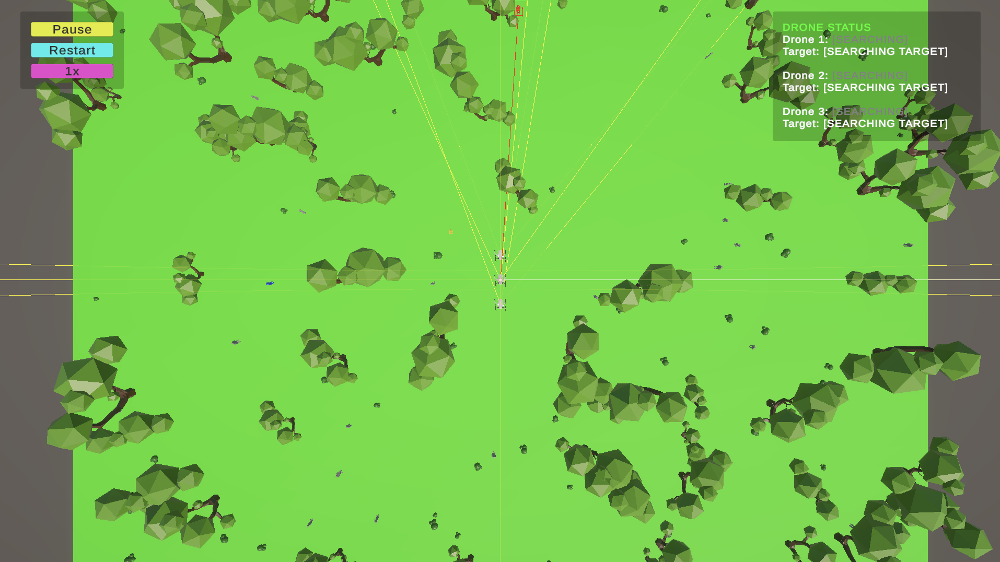
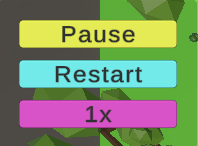
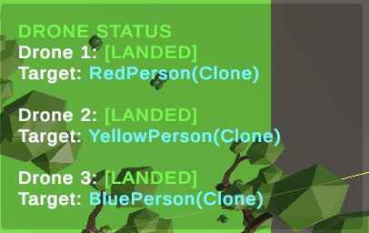

# Autonomous Drone Multi-Agent System

[](https://unity.com/)
[](https://docs.microsoft.com/en-us/dotnet/csharp/)
[](LICENSE)

> A  multi-agent system simulation featuring autonomous drones with vision-based person detection and coordination capabilities.

## Project Overview

This project implements an intelligent drone system that autonomously searches for and lands near people in a 3D park environment. Multiple drones coordinate to efficiently cover the area while avoiding conflicts through a centralized assignment system.

### Key Features
- **Autonomous Vision System**: Physics-based detection with obstacle handling
- **Multi-Drone Coordination**: Prevents targeting conflicts between agents
- **Real-time UI Controls**: Pause, restart, and speed control functionality
- **Live Status Monitoring**: Track each drone's state and target assignments
- **Realistic Environment**: 3D park with obstacles and line-of-sight challenges

## 🔧 Installation

### Setup Instructions

1. **Download the Unity Package**
   ```
   https://drive.google.com/drive/folders/1e5msq0kcWxq--s3bpFjkQ7nxeX3J-crL?usp=sharing
   ```

2. **Create Unity Project**
   - Open Unity Hub
   - Create new Universal 3D project

3. **Import Package**
   - Open the Assets tab and choose the Import Package option
   - Look for the unity package and open it
   - Choose the "All" option and import it
   - When pop-up appears, press "Reload"

4. **Configure Layers** ⚠️ *Important*
   - Add layers to the Unity project with correct index and identical names:
     - Layer 3: `Person`
     - Layer 6: `Obstacle`

5. **Configure Drone Settings**
   - Select drone objects in Hierarchy
   - In Inspector, modify: `Ground Mask = Ground`
   - Repeat for each drone

6. **Create Tag**
   - Create a new tag called `"Person"`
   - Apply to person objects in the scene

7. **Run Simulation**
   - Press Play in Unity
   - Enjoy the autonomous drone simulation!

## 🎮 User Interface
<div align="center">
  
</div>

### Control Panel
<div align="center">
  
</div>

- **Pause/Resume**: Pause or resume the simulation
- **Restart**: Reset the simulation to initial state  
- **Speed Control**: Adjust simulation speed (0.5x, 1x, 2x, 4x)

### Drone Status Panel
<div align="center">
  
</div>

- **Real-time Status**: Monitor each drone's current state:
  - 🔍 `[SEARCHING]` - Looking for targets
  - 🟡 `[FLYING TO TARGET]` - Moving towards assigned person
  - 🟠 `[LANDING]` - Descending to target location
  - 🟢 `[LANDED]` - Successfully landed and assigned

## 👥 Team Members

- Ana Elena Velasco García – A01639866  
- Baltazar Servín Riveroll – A01643496  
- Emilio Pardo Gutiérrez – A01644781  
- Jozef David Hernández Campos – A01644644  
- Maria José Medina Calderón – A01639205  

## 📚 Documentation

- [Review 1 PDF](Review1.pdf)
- [Review 2 PDF](Review2.pdf)
- [Review 3 PDF](Review3.pdf)